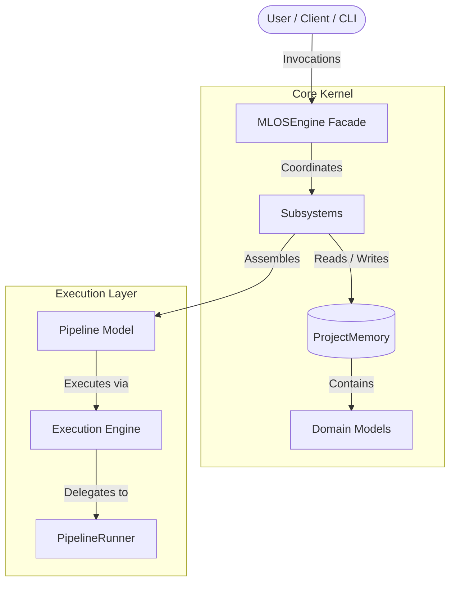
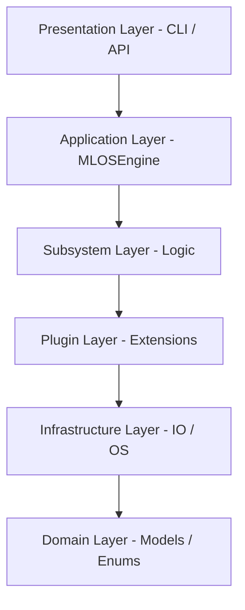
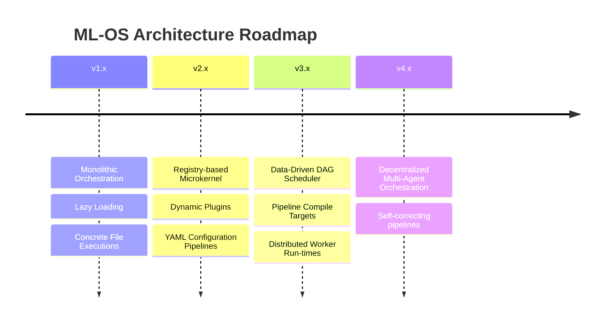

# ML-OS Architecture Specification

This document is the official architectural specification of **ML-OS**, serving as the permanent source of truth for design patterns, dependency rules, and evolutionary roadmaps.

---

## 1. Vision

### What is ML-OS?
**ML-OS** is an **Operating System for Machine Learning Engineering**. It is not a machine learning model, library, or pipeline wrapper (such as PyTorch or scikit-learn); it is a modular, runtime orchestration framework designed to manage and automate the entire machine learning lifecycle.

By defining standardized interfaces and utilizing a central blackboard state system, ML-OS abstracts away the complexities of ML engineering. It is designed to support a wide array of workloads, including:
* Classical Machine Learning & Statistical Modeling
* Deep Learning & Neural Network Pipelines
* Computer Vision (CV)
* Natural Language Processing (NLP) & Speech
* Time Series Analysis & Forecasting
* Reinforcement Learning (RL)
* LLM-powered Applications & Prompt Engineering
* Autonomous AI Agents
* MLOps (Deployment, Monitoring, and Telemetry)

### The Problems It Solves
1. **Automated Code Generation and Compilation:** Traditional AutoML and model-building tools operate as black-box packages, outputting serialized model weights rather than clean, explainable, and production-ready engineering code. ML-OS generates and compiles readable Python modules.
2. **Subsystem Entanglement:** Traditional ML engineering workflows suffer from tightly coupled data preparation, hyperparameter search, and evaluation logic. ML-OS enforces a strict separation of concerns, ensuring each step is isolated and testable.
3. **Lack of Extensibility:** ML toolchains are notoriously difficult to extend with custom logic. ML-OS is designed as a microkernel platform that allows seamless registration of third-party plugins.

### Why it is an "Operating System" for ML Engineering
In a computer operating system, the kernel coordinates resource allocation, process lifecycle, and memory management without knowing the inner business logic of user programs. Similarly, ML-OS acts as the **ML Lifecycle Kernel**:
* It does not contain hardcoded ML heuristics or assumptions.
* It coordinates the lifecycle flow and execution runtimes.
* It manages access to a shared state layer (`ProjectMemory`), acting as the file system and virtual memory of the ML engineering process.
* It schedules and executes specialized subsystem modules dynamically.

---

## 2. Design Philosophy

To ensure ML-OS remains maintainable as it scales to 300+ modules and supports extensive enterprise workloads, all development must adhere to the following principles:

* **Single Responsibility Principle (SRP):** Every module, engine, and service must own exactly one reason to change. Mix-ins or shared utility files containing mixed domain behaviors are strictly prohibited.
* **Separation of Concerns (SoC):** Logical phases of the ML lifecycle (analyzing data, making model choices, generating code, executing scripts) are completely isolated. Subsystems do not know of or interface with other subsystems.
* **Domain-Driven Design (DDD):** The framework's core is mapped directly to domain models (such as `Dataset`, `ProjectMemory`, `Decision`, `GeneratedCode`) which represent the language of ML engineering. Heuristic utility helpers are structured around these aggregates.
* **Composition over Inheritance:** We favor composed plugins and dynamic registries over heavy inheritance trees. Subsystems must be pluggable, testable, and hot-swappable at runtime.
* **Open/Closed Principle (OCP):** Subsystems must be open for extension (e.g., adding a new missing-value imputation strategy) but closed for modification. Extensibility is achieved via registration of new modules rather than modifying existing engines.
* **Framework over Application:** ML-OS is designed as a toolkit/runtime to build and run ML workflows, not as a single fixed desktop application. It exposes clean APIs, enabling CLI, REST, and IDE extensions to build on top of the same core kernel.
* **Explicit Architecture:** Magic behavior, implicit global variables, and automated monkey-patching are banned. Code flow must be explicit, typed, and traceable.

---

## 3. Framework Philosophy

The evolution of ML-OS is governed by the following core axioms, establishing how the framework grows over time:

* **Stable Abstractions over Rapidly Changing Features:** The core interfaces (contracts) and architecture must change slowly. Subsystem features, modeling frameworks, and algorithms can evolve rapidly.
* **Architecture Evolves Slowly; Features Evolve Rapidly:** New capabilities should fit naturally within the existing core architecture rather than forcing an architectural redesign.
* **Extensibility through Plugins:** Rather than modifying core engines to add support for a new model or preprocessor, developers must write and register plugins.
* **Small Composable Subsystems:** We prefer small, focused, and composable subsystems over large, monolithic, "intelligent" components.
* **Readability over Cleverness:** Code must be simple, transparent, and easy to audit. Performance optimization must not compromise the clarity of the architectural design.
* **Explicit Architecture over Hidden Magic:** We avoid implicit state transitions, automated background heuristics, and magic bindings. Every input, execution step, and state mutation must be declared explicitly.
* **Long-Term Maintainability over Short-Term Speed:** We prioritize the architectural integrity and future extensibility of the codebase over immediate delivery speed.

---

## 4. Core Architectural Principles (Frozen Rules)

The following architectural constraints are **permanently frozen** and cannot be violated by any contribution:

1. **The Blackboard Architecture Constraint:** 
   * *Rule:* Subsystems and Engines must **never** communicate directly with one another.
   * *Reason:* Direct engine-to-engine communication introduces $O(N^2)$ dependency complexity. By forcing all communication through the central state (`ProjectMemory`), dependencies remain linear ($O(N)$), and each engine remains independently testable.
2. **State vs. Behavior Separation:**
   * *Rule:* **Domain Models contain state; Engines contain behavior; Services contain infrastructure.**
   * *Reason:* Mixing data definitions, business heuristics, and filesystem IO leads to circular imports and untestable logic. 
3. **Unidirectional Processing Boundaries:**
   * *Rule:* Subsystem boundaries are strictly unidirectional:
     * **Decisions** never generate code (that is the Generator Engine's responsibility).
     * **Generators** never profile datasets (that is the Dataset Analyzer's responsibility).
     * **CodeAssembler** never makes modeling choices (that is the Decision Engine's responsibility).
     * **ExecutionEngine** never generates decisions.
   * *Reason:* Cross-talk between layers introduces circular logical flows and leaks domain concerns.
4. **Human-Readable Generated Code:**
   * *Rule:* The output of ML-OS must be clean, human-readable Python modules.
   * *Reason:* ML-OS is an engineering generator. The final deliverable is clean, human-inspectable code pipelines, not a closed-box memory block. Generating source code ensures full explanation, inspection, and production deployment portability.
5. **`PipelineRunner` Execution Abstraction:**
   * *Rule:* The `ExecutionEngine` must never execute code directly. It delegates execution to pluggable `PipelineRunner` implementations.
   * *Reason:* Decoupling execution from environment and execution-backend specifics ensures the framework remains backend-agnostic (local script vs. Ray/K8s).
6. **Stateless Validation:**
   * *Rule:* Domain models (including `Pipeline`) contain state only and must never perform validation. All pipeline validations are performed by a stateless `PipelineValidator`.
   * *Reason:* Keeps domain models lean and prevents business verification logic from polluting data contracts.

---

## 5. High-Level Architecture & Subsystem Concept

To scale cleanly, ML-OS divides its workspace into **Subsystems**. A Subsystem is the modular architectural unit of the framework. Each subsystem may contain:
* An **Engine** (the stateless entry point of the subsystem).
* **Contracts** (Abstract protocols and interfaces defining pluggable behavior).
* **Plugins** (Concrete implementations of contracts).
* **Utilities** (Helpers specific to the subsystem).
* **Tests** (Unit and integration suites validating the subsystem).



### Dependency Direction
Dependencies flow downward from the orchestration facade to the subsystems, and finally to the core domain models. 
* **Domain Models** are completely isolated and have no dependencies on the Engines, Services, or Presentation layer.
* **Subsystem Engines** depend only on standard interfaces (Contracts) and `ProjectMemory`.
* **Plugins** implement interfaces defined in the domain/engine layers, remaining independent of the core orchestrator implementation.

---

## 6. Layered Architecture

To achieve clean separation, ML-OS enforces a strict 6-layer architecture. Each layer may only depend on layers below it, never on layers above it.

```
┌───────────────────────────────────────────────────────────┐
│                    Presentation Layer                     │  e.g., CLI, REST API, VS Code Extension
└─────────────────────────────┬─────────────────────────────┘
                              ▼
┌───────────────────────────────────────────────────────────┐
│                    Application Layer                      │  e.g., MLOSEngine, ProjectLifecycleManager
└─────────────────────────────┬─────────────────────────────┘
                              ▼
┌───────────────────────────────────────────────────────────┐
│                       Subsystem Layer                     │  e.g., Decision Subsystem, Generation Subsystem
└─────────────────────────────┬─────────────────────────────┘
                              ▼
┌───────────────────────────────────────────────────────────┐
│                       Plugin Layer                        │  e.g., Custom missing-value generators
└─────────────────────────────┬─────────────────────────────┘
                              ▼
┌───────────────────────────────────────────────────────────┐
│                  Infrastructure Layer                     │  e.g., StorageService, ExecutionEngine
└─────────────────────────────┬─────────────────────────────┘
                              ▼
┌───────────────────────────────────────────────────────────┐
│                       Domain Layer                        │  e.g., ProjectMemory, Dataset, Decision, Pipeline
└───────────────────────────────────────────────────────────┘
```

### Layer Responsibilities
1. **Presentation Layer:** Exposes ML-OS to external runners (CLI shell, Web endpoints, IDE panels). Handles input sanitization and serializes outgoing JSON reports.
2. **Application Layer:** Orchestrates lifecycle transactions (creating/opening workspaces, sequencing engine execution runs, loading session configurations).
3. **Subsystem Layer:** Houses the logical business subdivisions (Analysis, Intelligence, Decision, Generation, Execution, Evaluation, Planning, Pipeline).
4. **Plugin Layer:** Houses third-party extensions (e.g. `PipelineRunner` backends, custom generators) that register with the subsystems to extend behavior.
5. **Infrastructure Layer:** Implements external-facing systems (file I/O, subprocess execution runtimes, model persistence, database storage).
6. **Domain Layer:** Contains core data structures and enums. It is the fundamental core of ML-OS, fully independent of external frameworks or libraries.

---

## 7. Subsystem & Engine Responsibilities

The primary operations of the ML-OS platform are divided into 9 functional subsystems. The Engine of each subsystem serves as its stateless entry point.

| Subsystem | Engine / Entry Method | Purpose | Key Inputs | Key Outputs | Non-Responsibilities |
| :--- | :--- | :--- | :--- | :--- | :--- |
| **Analysis** | `DatasetAnalyzer.analyze()` | Profile and extract dataset schemas and statistical metadata. | `DataFrame` / Data Path | `Dataset` (Metadata) | Modifying data, making decisions. |
| **Intelligence** | `IntelligenceEngine.analyze()` | Ingest dataset metadata to detect risks, complexity, and baselines. | `ProjectMemory` | `ProjectProfile` | Generating code, running pipelines. |
| **Decision** | `DecisionEngine.decide()` | Formulate ML modeling, feature engineering, and preprocessing steps. | `ProjectMemory` | `list[Decision]` | Writing code, analyzing raw datasets. |
| **Generation** | `GeneratorEngine.generate()` | Map abstract decisions into concrete, framework-specific code snippets. | `list[Decision]` (w/ params) | `list[GeneratedCode]` | Assembling files, executing code. |
| **Assembly** | `CodeAssembler.assemble()` | Merge, deduplicate, and compile code blocks into an executable pipeline. | `list[GeneratedCode]` | `Pipeline` | Making modeling decisions, running code. |
| **Pipeline** | `PipelineValidator.validate()` | Define and validate structural contracts for executable workflows. | `Pipeline` | `ValidationResult` | Executing pipelines, locating files. |
| **Execution** | `ExecutionEngine.execute()` | Execute the assembled pipeline script via pluggable runner backends. | `Pipeline` | Run metrics, log outputs | Provisioning files, evaluating model scores. |
| **Evaluation** | `EvaluationEngine.evaluate()`| Score trained model performance, computing metrics and validation checks. | Run metrics / output data | `EvaluationReport` | Running training loops, choosing models. |
| **Planning** | `Planner.plan()` | Formulate workflow schedules and define dependencies between tasks. | `ProjectMemory` | `list[Task]` | Executing tasks, generating code. |

* **MLOSEngine (Orchestrator):** Exposes a unified API facade to coordinate execution sequences across these subsystems. It does not contain domain heuristics or implementation details.

---

## 8. Domain Model Responsibilities

Domain models capture the state of the ML lifecycle. They are pure data containers containing zero external service dependencies or infrastructure logic.

### Core Models:
1. **[Project](file:///c:/Users/TVL%20SWAMY/Desktop/Fun/ml-os/mlos/domain/models/project.py):** Represents the workspace boundaries, goal, and status of the project.
2. **[ProjectMemory](file:///c:/Users/TVL%20SWAMY/Desktop/Fun/ml-os/mlos/domain/models/project_memory.py):** The central state aggregate root of the framework. Stores all compiled metadata, profiles, and decisions. For v1, it stores: `Dataset`, `ProjectProfile`, `Decisions` (list), `GeneratedCode` (list), `Pipeline`, and `Evaluation Results`. It contains no transaction logs or revision histories.
3. **[ProjectProfile](file:///c:/Users/TVL%20SWAMY/Desktop/Fun/ml-os/mlos/domain/models/project_profile.py):** Contains the intelligence snapshot (problem type, baseline recommendations, risks). Re-evaluated when datasets change.
4. **[Dataset](file:///c:/Users/TVL%20SWAMY/Desktop/Fun/ml-os/mlos/domain/models/dataset.py):** Captures schemas, dimensions, missing value maps, and column types. Kept in `ProjectMemory`.
5. **[Decision](file:///c:/Users/TVL%20SWAMY/Desktop/Fun/ml-os/mlos/domain/models/decision.py):** An abstract decision object (preprocessing choice, hyperparameter settings, model architectures) containing strategy parameters.
6. **[GeneratedCode](file:///c:/Users/TVL%20SWAMY/Desktop/Fun/ml-os/mlos/domain/models/generated_code.py):** Holds raw code text, required imports, and step dependencies.
7. **[Pipeline]:** Lightweight domain model representing an executable workflow. In v1, it contains only the minimal metadata required for execution (references to entrypoint script, requirements specifications, and configuration parameters). It does not perform validation or manage the filesystem.
8. **[Risk](file:///c:/Users/TVL%20SWAMY/Desktop/Fun/ml-os/mlos/domain/models/risk.py):** Captures an identified project risk (severity, description, affected columns, and mitigation recommendations).
9. **[Recommendation](file:///c:/Users/TVL%20SWAMY/Desktop/Fun/ml-os/mlos/domain/models/recommendation.py):** Suggests structural improvements to the engineering pipeline.
10. **[Task](file:///c:/Users/TVL%20SWAMY/Desktop/Fun/ml-os/mlos/domain/models/task.py):** Represents a single unit of execution in the scheduler's plan.
11. **[Workspace](file:///c:/Users/TVL%20SWAMY/Desktop/Fun/ml-os/mlos/domain/models/workspace.py):** Defines the host directories managing multiple ML-OS projects.
12. **[AnalysisReport](file:///c:/Users/TVL%20SWAMY/Desktop/Fun/ml-os/mlos/domain/models/analysis_report.py):** A read-only DTO wrapping the dataset summary, decisions, and recommendations for presentation.
13. **[Context](file:///c:/Users/TVL%20SWAMY/Desktop/Fun/ml-os/mlos/domain/models/context.py):** Tracks transient workspace state (current execution phase, progress percentage).
14. **[Activity](file:///c:/Users/TVL%20SWAMY/Desktop/Fun/ml-os/mlos/domain/models/activity.py):** Captures historical audit trails and event records of engine actions.
15. **[Evidence](file:///c:/Users/TVL%20SWAMY/Desktop/Fun/ml-os/mlos/domain/models/evidence.py):** Value Object mapping empirical metrics and sources backing a decision or risk.
16. **[Session](file:///c:/Users/TVL%20SWAMY/Desktop/Fun/ml-os/mlos/domain/models/session.py):** Represents a short-lived user interaction scope (objective, title).

---

## 9. Pipeline Lifecycle

The dataflow in ML-OS is strictly unidirectional, advancing sequentially through lifecycle phases:


### Transition Specifications:
1. **Raw Dataset $\rightarrow$ Analysis:** Extraction of schemas, duplicate counts, and statistics.
2. **Analysis $\rightarrow$ Project Profile:** Intelligence Engine detects risks (e.g. high missing values) and infers baseline configurations.
3. **Project Profile $\rightarrow$ Decision Engine:** Abstract strategies (e.g. median imputation) are formulated as validated decision models.
4. **Decision Engine $\rightarrow$ Generator Engine:** Strategy-specific code generators render abstract decisions into code blocks.
5. **Generator $\rightarrow$ CodeAssembler:** Snippets are topologically sorted, variables aligned, and compiled into a `Pipeline` model containing references to filesystem assets on disk.
6. **Pipeline $\rightarrow$ ExecutionEngine:** Pluggable `PipelineRunner` backends execute the pipeline; training logs and metrics are collected.
7. **Execution $\rightarrow$ EvaluationEngine:** Telemetry is analyzed to verify performance standards and generate accuracy, latency, and bias reports.

---

## 10. Pipeline Domain Model

The `Pipeline` is the domain model representing an executable ML workflow.

### Purpose of the `Pipeline` Model:
* It defines the logical boundaries and steps of a generated machine learning workflow.
* It wraps the execution manifest (entrypoint script path, requirements path, configuration path) and serves as the bridge to runtime execution.
* The model is strictly state-only. All folder and file operations on disk are managed by infrastructure services. All validation is performed by the stateless `PipelineValidator`.

### Evolution across Versions:
* **Version 1 (v1.x) - Executable Metadata Wrapper:** The `Pipeline` is lightweight, containing only the absolute paths of compiled scripts, requirements, and execution configs on disk.
* **Version 2 (v2.x) - Configurable Workflows:** Define a structured configuration schema (YAML/JSON) representing the execution blocks and flow, separating code template references from assembly logic.
* **Version 3 (v3.x) - Dynamic Executable Runtime:** Run pipelines directly on distributed runner configurations, supporting step-level caching, validation schemas, and execution scheduling.

---

## 11. Extension Points (Plugin Architecture)

To enable third-party additions without core codebase changes, ML-OS exposes standard registry boundaries in each subsystem:

### Plugin Contracts
Plugins must implement standard Python interfaces. For example, a custom code generator:
```python
from abc import ABC, abstractmethod

class GeneratorPlugin(ABC):
    @abstractmethod
    def can_generate(self, decision: Decision) -> bool: ...
    
    @abstractmethod
    def generate(self, decision: Decision, context: GenContext) -> GeneratedCode: ...
```

### Registration Mechanisms
Developers distribute their plugins as standard Python packages containing an entry point in `pyproject.toml`:
```toml
[project.entry-points."mlos.generators"]
xgboost_generator = "mlos_xgb.generators:XGBoostGenerator"
```
During subsystem initialization, `GeneratorEngine` queries the metadata entry points and dynamically registers the plugin class:
```python
import importlib.metadata

def load_generator_plugins(engine: GeneratorEngine):
    entries = importlib.metadata.entry_points(group="mlos.generators")
    for entry in entries:
        generator_class = entry.load()
        engine.register_generator(generator_class())
```

This pattern applies identically to **Dataset Analyzers** (registered in `DatasetAnalyzer`), **Deciders** (registered in `DecisionEngine`), and **Pipeline Runtimes** (registered as `PipelineRunner` in `ExecutionEngine`).

---

## 12. Dependency Rules

To prevent dependency loops and circular imports, ML-OS enforces a strict unidirectional dependency rule: **Dependencies may only flow downwards towards the Domain Layer.**



### Prohibited Dependencies:
* **Domain Layer** must have **zero** dependencies on any other layer (it cannot import engines, services, or CLI controllers).
* **Infrastructure Layer** must never depend on the Subsystem, Application, or Presentation layers. It handles file writing, subprocess launches, and hardware operations using input models and raw data parameters.
* **Subsystem Layer** must never import concrete plugins or application orchestration classes (`MLOSEngine`). It interfaces with plugins only through standard contract protocols.
* **Circular Imports:** Under no circumstances should two modules depend on each other. If circular dependencies occur, the shared structures must be extracted to the Domain layer or refactored.

---

## 13. Coding & Architectural Standards

All contributions to ML-OS must strictly adhere to the following code organization rules:

### Naming Conventions:
1. **Engines:** Must end with the suffix `Engine` (e.g. `DecisionEngine`, `GeneratorEngine`). They should expose exactly one primary public method named after their core behavior (`decide()`, `generate()`).
2. **Domain Models:** Must use singular Nouns (e.g., `Dataset`, `Decision`, `Pipeline`). Must inherit from `BaseModel` (except transient value structures).
3. **Services:** Must end with the suffix `Service` (e.g. `ProjectMemoryService`, `StorageService`). They manage I/O, database interactions, or metadata mutation.

### Directory Organization:
```
mlos/
├── domain/
│   ├── models/       # Pure state models inheriting from BaseModel
│   └── enums/        # Pure enums representing domain states (Stage, Status)
├── engine/           # Orchestrator facade (MLOSEngine)
├── <subsystem>/      # Subsystems (e.g., decision, generator, analysis, pipeline)
│   ├── <subsystem>_engine.py  # Primary Engine class or Validator
│   ├── contracts/             # Abstract Python Protocols / Interfaces
│   └── plugins/               # Built-in plugins or adapters
└── io/               # Concrete infrastructure I/O handlers (DataLoader)
```

### Registration & Plugin Conventions:
* Hardcoded engine subclass registration is strictly prohibited. 
* Extensions must register dynamically via registry containers or metadata entry points.
* Engine code must be decoupled from plugin initialization parameters.

---

## 14. Evolution Roadmap

The architectural evolution of ML-OS is divided into four distinct milestone versions. The roadmap prioritizes stability and isolation of the core kernel before expanding feature targets.



* **v1.x (Monolithic Orchestration):** Manual facade routing. Hardcoded engines. File-based execution on disk via local `PipelineRunner`.
* **v2.x (Registry-based Microkernel):** Engines decoupled from orchestrator via service registries. Dynamic plugin discovery via entry points. Formalization of standard protocol interfaces. If ML-OS eventually reaches sufficient architectural complexity, lightweight dependency resolution may be evaluated, but we avoid premature enterprise abstractions.
* **v3.x (DAG Scheduler & Distributed Execution):** Transition to a Data-Driven DAG Scheduler. Decoupling from local subprocess execution to support Ray, Spark, and Kubernetes runtimes.
* **v4.x (Distributed Multi-Agent Architecture):** Integration of autonomous AI agents working on independent pipeline branches.

---

## 15. Architectural Decisions Frozen Forever

The following decisions are the core axioms of ML-OS. Under no circumstances will proposals to alter these paradigms be approved:

1. **The Blackboard Pattern (ProjectMemory Core):**
   * *Why:* Keeping all engine state in `ProjectMemory` prevents $O(N^2)$ direct-routing interfaces. It ensures that any engine can be run independently in isolation or tests by simply mocking a `ProjectMemory` file.
2. **Stateless Engines:**
   * *Why:* Engines must not maintain internal lifecycle states or variables. This guarantees that calling an engine with the same `ProjectMemory` is deterministic and side-effect-free, enabling distributed execution and retry caching.
3. **Unidirectional Execution Lifecycle:**
   * *Why:* The pipeline must process state forward: `Analysis -> Profile -> Decisions -> Generation -> Assembly -> Execution -> Evaluation`. Backward dependencies (e.g., an ExecutionEngine directly updating a Decision) are banned. Loopback correction must occur only by feeding results back into the start of `ProjectMemory`.
4. **Code Generation via Compilation (No Direct Runtime Mutation):**
   * *Why:* ML-OS is an engineering generator. The final deliverable is clean, human-inspectable code pipelines, not a closed-box memory block. Generating source code ensures full explanation, inspection, and production deployment portability.
5. **`PipelineRunner` Abstraction:**
   * *Why:* Execution mechanics are separated from the orchestrator logic. Pluggable execution backends subclass the runner to execute the pipeline manifest, keeping the kernel compute-agnostic.
6. **Stateless validation (`PipelineValidator`):**
   * *Why:* Ensures that the `Pipeline` domain model behaves as a pure state aggregate root. The business validation constraints are maintained in a stateless validation engine.

---

## 16. Future Research Topics

The following architectural directions are recognized as highly valuable but are **intentionally postponed** to maintain focus on core API stability:

1. **Intermediate Representation (IR) Pipeline Compilation:** Compiling pipeline DAGs into abstract representations before code generation, allowing multi-target execution.
2. **Event-Sourced Project Memory & Revision History:** Event-sourcing and transaction logging for tracing and rolling back project states.
3. **Distributed Process Worker Execution (Ray / Kubernetes):** Postponed to avoid bringing heavy infrastructure runtime dependencies into the local package setup.
4. **Interactive Multi-Agent Orchestration:** Coordination of multiple autonomous AI agents using branching memory paths.
5. **Lightweight Dependency Injection Container:** Dynamic injection framework to resolve engine dependencies automatically.
