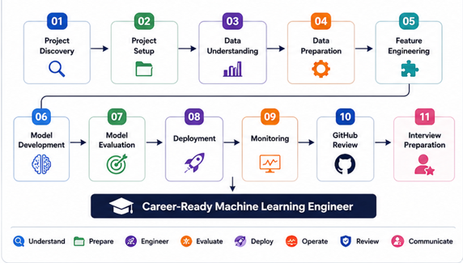
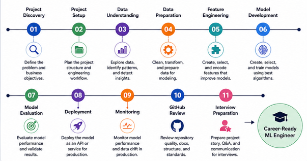

<p align="center">
  
</p>

# 🚀 ML-OS

> **An End-to-End Machine Learning Engineering Framework**
>
> Design • Build • Evaluate • Deploy • Monitor • Review • Interview


ML-OS is a structured engineering framework that guides Machine Learning projects from **business problem discovery** to **production deployment**, **repository management**, and **technical interview readiness**.

It provides a standardized workflow, reusable engineering artifacts, and best practices that help developers build production-ready Machine Learning systems while following a consistent engineering process.

---

## ✨ Highlights

- 📌 Complete end-to-end ML workflow
- 🧠 Project State–driven architecture
- 🏗️ Modular engineering framework (11 modules)
- 📊 Standardized engineering artifacts & blueprints
- 🚀 Deployment and production monitoring guidance
- 📂 Professional GitHub repository management
- 🎯 Technical interview preparation framework
- 🔄 Reusable across multiple Machine Learning projects

---

> **From Business Problem → Career-Ready Machine Learning Engineer**


## 📖 Introduction

Machine Learning projects often begin with excitement but quickly become difficult to manage as they grow in complexity. Teams frequently struggle with inconsistent workflows, scattered documentation, ad-hoc engineering decisions, deployment challenges, and a lack of standardized development practices.

**ML-OS (Machine Learning Operating System)** was created to solve this problem.

Rather than being another Machine Learning tutorial or project template, ML-OS is a **structured engineering framework** that standardizes the complete Machine Learning lifecycle—from the initial business problem to production deployment, monitoring, repository management, and interview preparation.

The framework is built around a modular architecture where each stage of the Machine Learning lifecycle has clearly defined responsibilities, inputs, outputs, validation rules, quality gates, and reusable engineering artifacts.

Whether you are building your first Machine Learning project or developing production-grade AI systems, ML-OS provides a repeatable workflow that promotes consistency, maintainability, reproducibility, and engineering best practices.

---

## 🎯 Vision

To provide a standardized operating framework that enables developers and teams to build, deploy, maintain, and present Machine Learning systems using professional software engineering practices.

---

## 🎯 Mission

Enable Machine Learning engineers to move beyond writing models by providing a complete engineering workflow that covers:

- Business problem discovery
- Project planning
- Data understanding and preparation
- Feature engineering
- Model development and evaluation
- Production deployment
- Monitoring and maintenance
- Repository management
- Technical interview readiness

ML-OS bridges the gap between learning Machine Learning and practicing Machine Learning Engineering.

## 💡 Why ML-OS?

Most Machine Learning projects focus on building a model. However, real-world Machine Learning engineering involves much more than model training.

Developers often face challenges such as:

- Inconsistent project organization
- Unstructured development workflows
- Poor documentation
- Lack of reproducibility
- Deployment difficulties
- Missing monitoring strategies
- Weak repository management
- Limited interview preparation despite completing projects

ML-OS addresses these challenges by providing a structured engineering framework that standardizes every stage of the Machine Learning lifecycle.

Instead of treating a project as a collection of notebooks and scripts, ML-OS treats it as a professional engineering system.

---

### Traditional ML Projects

❌ Every project follows a different workflow.

❌ Documentation is often incomplete.

❌ Engineering decisions are rarely recorded.

❌ Deployment is usually an afterthought.

❌ Monitoring is frequently ignored.

❌ Projects become difficult to maintain.

❌ Interview preparation happens separately from project development.

---

### ML-OS Approach

✅ Standardized end-to-end workflow.

✅ Clearly defined responsibilities for every stage.

✅ Reusable engineering artifacts and blueprints.

✅ Built-in validation and quality gates.

✅ Production-oriented deployment guidance.

✅ Monitoring and maintenance strategy.

✅ Professional repository management.

✅ Interview preparation integrated into the engineering lifecycle.

---

## 🌟 What Makes ML-OS Different?

Unlike:

- Machine Learning roadmaps
- Online courses
- Project templates
- Coding tutorials
- Notebook collections

ML-OS provides a **complete engineering operating framework**.

It defines:

- **What** should be done.
- **Why** it should be done.
- **When** it should be done.
- **How** it should be validated.
- **What artifacts** should be produced.
- **How knowledge** should be preserved throughout the project lifecycle.

This structured approach makes Machine Learning projects easier to build, maintain, reproduce, and explain.


## ✨ Key Features

| Feature | Description |
|----------|-------------|
| 🏗️ **11 Structured Modules** | Covers the complete Machine Learning lifecycle from project discovery to interview preparation. |
| 📋 **Standardized Workflow** | Every project follows a repeatable engineering process with clearly defined stages. |
| 📦 **Engineering Blueprints** | Generates reusable reports, blueprints, checklists, and documentation throughout the project lifecycle. |
| 🧠 **Project State Management** | Preserves project knowledge across modules for consistency and traceability. |
| 📊 **Built-in Validation & Quality Gates** | Each module includes validation rules to ensure engineering quality before progressing. |
| 🚀 **Production-Oriented Deployment** | Covers deployment strategies, APIs, containerization concepts, and production readiness. |
| 📈 **Monitoring & Maintenance** | Includes model monitoring, data drift detection, retraining strategies, and operational best practices. |
| 📂 **Professional Repository Standards** | Provides GitHub review workflows, documentation standards, and repository organization guidelines. |
| 🎯 **Interview Preparation Framework** | Transforms completed projects into interview-ready knowledge with mock interviews, question banks, and discussion guides. |
| 🔄 **Reusable Across Projects** | Apply the same structured workflow to classification, regression, forecasting, NLP, computer vision, and other ML projects. |

---

## 🏆 Core Principles

ML-OS is built on the following engineering principles:

- **Business First** – Every project starts with understanding the business problem.
- **Engineering over Experimentation** – Prioritize structured workflows instead of ad-hoc development.
- **Reproducibility** – Ensure projects can be recreated consistently.
- **Modularity** – Separate responsibilities into well-defined modules.
- **Documentation by Design** – Generate engineering artifacts throughout the project lifecycle.
- **Quality at Every Stage** – Validate outputs before progressing to the next module.
- **Production Readiness** – Build systems that are deployable and maintainable.
- **Continuous Improvement** – Monitor, review, and refine models after deployment.
- **Career Readiness** – Prepare developers to confidently explain and defend their engineering decisions.

## 🛠️ Built With

ML-OS is built using industry-standard tools and engineering practices.

| Category | Technologies |
|----------|--------------|
| Documentation | Markdown |
| Version Control | Git, GitHub |
| Diagrams | Draw.io, Mermaid, Canva |
| Machine Learning | Python, Scikit-learn, Pandas, NumPy |
| Engineering Practices | MLOps, Git Workflow, Documentation Standards |
| Development Environment | Visual Studio Code |


## 🏛️ ML-OS Architecture Overview

<p align="center">
  
</p>

ML-OS follows a modular, sequential architecture where each module is responsible for a specific stage of the Machine Learning engineering lifecycle.

Every module has clearly defined:

- Responsibilities
- Inputs
- Outputs
- Validation Rules
- Quality Gates
- Engineering Artifacts

Knowledge flows across modules through a shared **Project State**, allowing every stage to build upon the outputs of the previous stages while maintaining consistency throughout the project lifecycle.

---

```text
Business Problem
        │
        ▼
01. Project Discovery
        │
        ▼
02. Project Setup
        │
        ▼
03. Data Understanding
        │
        ▼
04. Data Preparation
        │
        ▼
05. Feature Engineering
        │
        ▼
06. Model Development
        │
        ▼
07. Model Evaluation
        │
        ▼
08. Deployment
        │
        ▼
09. Monitoring
        │
        ▼
10. GitHub Review
        │
        ▼
11. Interview Preparation
        │
        ▼
Career-Ready Machine Learning Engineer
```

---

### 🧠 Core Architectural Components

ML-OS is built around several core architectural concepts:

| Component | Purpose |
|-----------|---------|
| **ML-OS Kernel** | Coordinates workflow execution and module interactions. |
| **Project State** | Maintains project knowledge and engineering context across all modules. |
| **Modules** | Independent workflow stages responsible for specific engineering tasks. |
| **Artifacts** | Structured outputs such as reports, blueprints, checklists, and assessments generated throughout the workflow. |
| **Quality Gates** | Validation checkpoints that ensure engineering quality before progressing to the next module. |
| **AI Reasoning Engines** | Specialized reasoning frameworks that guide decision-making within each module. |

---


## 📚 Module Overview

ML-OS is organized into **11 sequential modules**, each responsible for a specific phase of the Machine Learning engineering lifecycle.

| Module | Focus | Primary Outcome |
|---------|-------|-----------------|
| **01. Project Discovery** | Business Understanding & Problem Definition | Project Discovery Report |
| **02. Project Setup** | Repository Structure & Engineering Planning | Engineering Blueprint |
| **03. Data Understanding** | Exploratory Data Analysis (EDA) & Dataset Profiling | Dataset Blueprint |
| **04. Data Preparation** | Data Cleaning, Transformation & Preprocessing | Preparation Blueprint |
| **05. Feature Engineering** | Feature Creation, Selection & Encoding | Feature Blueprint |
| **06. Model Development** | Algorithm Selection, Training & Optimization | Model Blueprint |
| **07. Model Evaluation** | Performance Analysis & Model Validation | Evaluation Blueprint |
| **08. Deployment** | Production Deployment & API Integration | Deployment Blueprint |
| **09. Monitoring** | Model Monitoring & Maintenance | Monitoring Blueprint |
| **10. GitHub Review** | Repository Quality & Documentation Standards | Repository Review Report |
| **11. Interview Preparation** | Technical Interview Readiness & Project Communication | Interview Preparation Report |

---


## 🗂️ Repository Structure


```text
ml-os/
│
├── assets/                 # Images and diagrams
├── docs/                   # Additional documentation
├── kernel/                 # Core framework concepts
├── modules/                # 11 ML-OS modules
├── project-management/     # Planning resources
├── roadmap/                # Future roadmap
├── sample-projects/        # Example implementations
├── templates/              # Reusable templates
├── workflows/              # Workflow definitions
│
├── README.md
├── CHANGELOG.md
├── CONTRIBUTING.md
├── LICENSE
└── .gitignore
```

> **Note:** The `modules/` directory contains the complete documentation for every stage of the ML-OS framework.


## 🚀 Getting Started

Follow these steps to begin using ML-OS.


### 1. Clone the repository

```bash
git clone https://github.com/tvlswamy27/ml-os.git
cd ml-os
```

### 2. Explore the modules

Read the modules sequentially:

```text
01 → 02 → 03 → ... → 11
```

Each module builds upon the previous one.

### 3. Apply ML-OS to your project

Start with your business problem and follow the complete workflow through deployment, monitoring, repository review, and interview preparation.

By the end of the workflow, you'll have:

- A complete Machine Learning project
- Engineering documentation
- Reusable artifacts
- Production deployment guidance
- Professional repository structure
- Interview-ready project knowledge


## 🚀 Example Workflow

<p align="center">
  
</p>

ML-OS can be applied to any Machine Learning project by following the modules sequentially.

### Example: Customer Churn Prediction

```text
Business Problem
        │
        ▼
01. Define the churn prediction objective
        │
        ▼
02. Set up the project repository
        │
        ▼
03. Explore and understand customer data
        │
        ▼
04. Clean and preprocess the dataset
        │
        ▼
05. Engineer meaningful features
        │
        ▼
06. Train multiple ML models
        │
        ▼
07. Evaluate and select the best model
        │
        ▼
08. Deploy the model as an API
        │
        ▼
09. Monitor production performance
        │
        ▼
10. Review repository quality
        │
        ▼
11. Prepare for project interviews
```

By following this workflow, every project benefits from a consistent engineering process, standardized documentation, and production-ready best practices.

## 🚧 Roadmap

### ✅ ML-OS v1.0

- [x] Project Discovery
- [x] Project Setup
- [x] Data Understanding
- [x] Data Preparation
- [x] Feature Engineering
- [x] Model Development
- [x] Model Evaluation
- [x] Deployment
- [x] Monitoring
- [x] GitHub Review
- [x] Interview Preparation

### 🔮 Future Releases

Potential areas for future development include:

- LLM Engineering
- Retrieval-Augmented Generation (RAG)
- AI Agent Workflows
- Multi-Agent Collaboration
- Advanced MLOps
- CI/CD for Machine Learning
- Cloud-Native Deployments
- Knowledge & Memory Management


## 🤝 Contributing

Contributions are welcome!

If you have ideas for improving ML-OS, fixing issues, or expanding the framework, feel free to:

1. Fork the repository.
2. Create a new feature branch.
3. Commit your changes.
4. Submit a Pull Request.

For major changes, please open an issue first to discuss the proposed improvements.

Together, we can continue evolving ML-OS into a comprehensive Machine Learning engineering framework.


## 📜 License

This project is licensed under the **MIT License**.

See the [LICENSE](LICENSE) file for details.


## 👨‍💻 Author

**Vikram Lakshmana Swamy Tanakala**

- 🎓 Electronics & Communication Engineering, NIT Srinagar
- 💡 Passionate about Machine Learning Engineering, AI Systems, and MLOps
- 🌐 GitHub: https://github.com/tvlswamy27

---

⭐ If you found ML-OS useful, consider giving the repository a **Star** to support the project.


