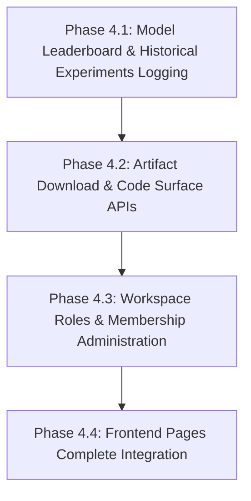

# Phase 4: Architecture Audit & Implementation Plan

## Executive Summary
This document outlines the Phase 4 Architecture Audit and Implementation Plan for the Machine Learning Operating System (ML-OS). 
Phase 3.1 frontend integration successfully established a secure, live-connected React client communicating with the FastAPI backend via session cookies, TanStack Query, and native EventSource (SSE). All simulated progression loops and fake metrics have been fully eliminated.

The purpose of this audit is to trace the execution flows across the backend engines (AutoML, Reflection, Tracking, Planning, Code Generation) and structure an implementation-ready Phase 4 roadmap.

---

## 1. Current Architecture
The current system operates on a clean multi-layer design:
```
[React Website (Client Port 5173)]
         ↓ (HttpOnly Session Cookies + TanStack Query / EventSource)
[FastAPI UI API (Server Port 8000)]
         ↓ (Orchestrates Project Lifecycle)
[MLProject Facade]
         ↓ (Delegates Lifecycle Phases)
[MLOSEngine]
         ↓
  +--------------------------------------------------------+
  | Analysis → Planning → AutoML Search → Code Generation  |
  +--------------------------------------------------------+
         ↓ (Launches Compiled Pipeline Execution)
[Subprocess Runner]
         ↓ (Subscribes & Triggers Events)
[GlobalEventBus] ──→ [EventStreamService (SSE Streaming)] ──→ [React UI]
```

---

## 2. Complete Lifecycle Trace
The canonical execution lifecycle spans the following sequential stages:
1. **Analysis**: Evaluates raw dataset files on disk, finger-prints tables, identifies types, and records missing ratios.
2. **Planning**: Resolves target columns, complexity levels, and recommends models/preprocessing routes.
3. **AutoML Search**: Orchestrates HPO search algorithms across scikit-learn/custom estimators, tracking CV means and training metrics.
4. **Decision**: Selects the optimal model candidate, hyperparameter set, and preprocessing pipelines.
5. **Code Generation**: Computes a dataset-aware source assembly code.
6. **Assembly**: Assembles code into an executable standalone script (`pipeline.py`).
7. **Execution**: Spawns a separate Python subprocess to execute the generated pipeline.
8. **Evaluation**: Audits predictions, computes validation scores, and saves telemetry log details.
9. **Tracking**: Persists run metrics, parameters, and artifact paths into the `ExperimentTracker` database logs.
10. **Reflection**: Triggers the `ReflectionEngine` to run rule-based heuristics over historical runs and formulate corrective actions.

---

## 3. Subsystem Audits

### 3.1 ExperimentTracker Audit
- **Creation/Persistence**: Logs are written to `.mlos/experiments/experiments.json` inside each project's directory path.
- **Run Record Structure**: Records metrics, hyperparameters, cv_scores, times, memory, and environment details for the *selected model* only.
- **Identified Gap**: `ExperimentRecord` only lists candidate model names (`candidate_models: list[str]`), but lacks the detailed performance metrics, CV score spreads, and hyperparameters of all non-winning model candidates. Thus, a past run's full leaderboard cannot be fully reconstructed from the serialized file.
- **Required Endpoint**: `GET /api/projects/{project_id}/experiments` returns list of all logged records in tracker.

### 3.2 Model Leaderboard Audit
- **AutoML Results**: Currently computed dynamically in memory during HPO iterations inside `AutoMLOrchestrator`.
- **Ranking Logic**: Sorted by cross-validation performance.
- **Identified Gap**: Since detailed metrics of candidates are discarded after run serialization, the frontend cannot load the model ranking board of historical completed experiments.
- **Required Fix**: Enhance `ExperimentRecord` to store an array of structured candidate logs (`runs: list[dict]`) detailing metrics and params of all HPO models.

### 3.3 Workspace Role Authorization Audit
WorkspaceMember defines role options: `admin`, `member`, `viewer`. Currently, membership access checks (`verify_project_access`) permit write-access to all members.
We require strict role boundary checks:
- **VIEWER**: Can read projects, analysis parameters, active runs, and download compiled pipelines. Rejects `POST/PUT/DELETE` commands.
- **MEMBER**: Viewer permissions + create projects, run dataset analyses, execute AutoML loops, and cancel their own runs.
- **ADMIN**: Member permissions + manage users/roles in the workspace and delete projects.

### 3.4 Reflection Engine Audit
- **RuleBasedReflectionAlgorithm**: **PARTIALLY IMPLEMENTED**. Correctly translates project memory metadata, Computes MetricStats, ExecutionStats, PlanningStats, and TrendStats to output insights and feedbacks.
- **Subsystem hook**: **CONNECTED**. Integrated at the end of MLOSEngine execution loop (`self.reflection_service.reflect`).
- **Gaps**: Plan-feedback loops are not actively processed by the PlanningEngine to modify subsequent HPO search parameters (it is currently log-only feedback).

### 3.5 ProjectMemory Audit
- **Blackboard Persistence**: Serializes to `.mlos/project_memory.json`.
- **Checkpoint/Resume**: **NOT IMPLEMENTED**. Interruptions during execution require restarting the AutoML process from the beginning.
- **Large Objects**: Complies with the rule: DataFrames and model estimator binaries are kept on disk under `artifacts/` as relative paths.

### 3.6 Artifact Management Audit
- **Artifacts**: Standalone pipelines (`pipeline.py`), joblib binaries (`model.joblib`), evaluation matrices, and runtime logs.
- **Identified Gap**: No FastAPI routes exist to fetch or download these files.
- **Required API**: `GET /api/projects/{project_id}/artifacts/download?path={path}`. Includes strict path bounds check to prevent directory traversal.

---

## 4. API & Page Gaps

### 4.1 API Inventory & Gaps

| Endpoint | Category | Status | Action Required |
|---|---|---|---|
| `/api/auth/*` | AUTH | **PASS** | None |
| `/api/workspaces` | WORKSPACE | **PASS** | Add role checks |
| `/api/projects` | PROJECT | **PASS** | Add role checks |
| `/api/projects/{id}/details` | PROJECT | **PASS** | None |
| `/api/projects/{id}/analyze` | ANALYSIS | **PASS** | Add path checks |
| `/api/projects/{id}/run` | RUN | **PASS** | Add role checks |
| `/api/projects/{id}/run/status/{id}` | RUN | **PASS** | None |
| `/api/projects/{id}/run/cancel/{id}` | CANCELLATION | **PASS** | Verify cancellation owner |
| `/api/projects/{id}/run/events/{id}` | SSE | **PASS** | Enforce auth |
| `/api/projects/{id}/experiments` | EXPERIMENT | **MISSING** | **NEW API** |
| `/api/projects/{id}/leaderboard` | MODEL | **MISSING** | **NEW API** (or retrieve via details) |
| `/api/projects/{id}/artifacts/download` | ARTIFACT | **MISSING** | **NEW API** |
| `/api/workspaces/{id}/members` | ADMIN | **MISSING** | **NEW API** (Invite/Role Management) |

### 4.2 Frontend Page Gaps
- **Dashboard**: Need to hook up real active runs count, workspace member list, and clean state selectors.
- **Experiments**: Replaces visual empty note with real `GET /api/projects/{id}/experiments` query table mapping.
- **Artifacts Page / Code Viewer**: Integrated downloads for `pipeline.py`, `model.joblib` and runtime logs.
- **Workspace Management**: Simple portal to view and invite workspace members.

---

## 5. Security & DB Audits

### 5.1 SQLite Schema Expansion
To manage workspace invitations and role updates, we require minimal schema modifications in SQLite:
- No table schema migrations are required for ML experiments (preserved strictly within tracker JSON).
- Extension of `workspace_members` role updates and invitations support.

### 5.2 Security Hardening
- **Path Traversal**: Validate artifact downloads path bounds.
- **SSE Validation**: Verify project membership checks on connections.
- **CSRF**: Hook up standard CORS credentials boundary limits.

---

## 6. Proposed Phase 4 Implementation Plan



### Phase 4.1: Model Leaderboard & Historical Experiments Logging
- **Goal**: Persist full candidate model evaluations during HPO to support frontend model ranking lists.
- **Changes**:
  - Update `ExperimentRecord` and `ExperimentTracker.log_experiment` to accept and serialize a list of HPO trial dictionaries (name, metric, score, params, status).
  - Implement `GET /api/projects/{project_id}/experiments` in `routers/project.py`.
- **Verification**: Run `test_experiment_tracking.py`. Create test validating database trial logs.

### Phase 4.2: Artifact Download & Code Surface APIs
- **Goal**: Support viewing and downloading files securely.
- **Changes**:
  - Create `GET /api/projects/{project_id}/artifacts/download` returning a `FileResponse` with traversal checks.
  - Expose artifact names/sizes in `GET /api/projects/{project_id}/details`.
- **Verification**: Write unit test attempts to download outside folder bounds (e.g. `path=../../etc/passwd`), asserting 403.

### Phase 4.3: Workspace Roles & Membership Administration
- **Goal**: Enforce viewer/member/admin permissions on endpoints.
- **Changes**:
  - Create dependency helpers checking roles in `WorkspaceMember`.
  - Add routes: `POST /api/workspaces/{workspace_id}/members` (invite), `PUT/DELETE /api/workspaces/{workspace_id}/members/{user_id}` (update/delete member).
- **Verification**: Add tests asserting that a "viewer" user receives 403 Forbidden when calling `/run` or `/analyze`.

### Phase 4.4: Frontend Pages Complete Integration
- **Goal**: Hook up the new APIs to React pages.
- **Changes**:
  - Integrate Query hooks for `/experiments`, `/artifacts`, and `/members`.
  - Wire up the Leaderboard tab and download buttons.
- **Verification**: Run `npm run build` and `npm run lint`. Validate that no TypeScript errors exist.

---

## 7. Open Decisions Requiring User Approval
> [!IMPORTANT]
> The following architectural details must be reviewed and approved prior to beginning Phase 4 code modifications:

1. **Experiments Serialization Strategy**: Should candidate model parameters and detailed CV scores be stored inside `experiments.json` (making the file larger but self-contained), or should we only store references to model trials recorded under `artifacts/`?
2. **Workspace Roles Mapping**: Do you approve the proposed mapping of VIEWER (read-only), MEMBER (project operations), and ADMIN (workspace management), or should we introduce granular fine-grained ACLs?
3. **Invitations Logic**: Should inviting a user simply create a row in the `workspace_members` table if the user exists, or do we require an invitation approval flow?
